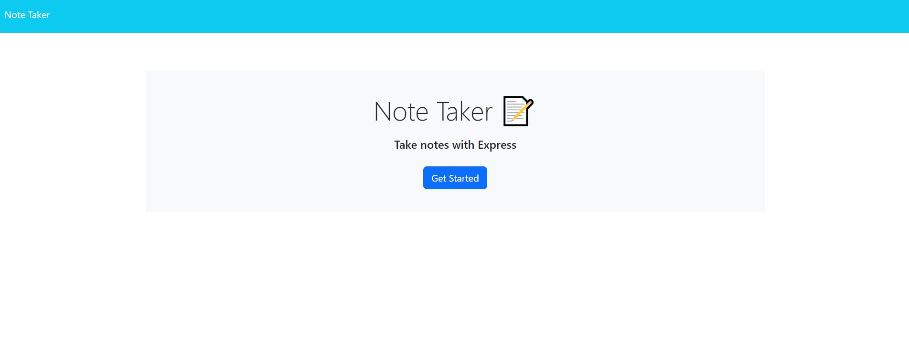

# 11-note-taker

## Description

The [application for taking notes](https://note-taker-kv.herokuapp.com/) can be used to add new notes and see previously logged notes on the left hand side of the browser. This code was refactored from starter code to practice connecting backend Express.js to the front end application.

## Usage

This application demonstrates CRUD by using Create (POST) and Read (GET).

## Comments

This application is deployed through heroku where the following code was used to deploy from the repo on a local device and linked to the published repo on GitHub:

heroku git:remote -a note-taker-kv

git remote heroku main

Setup of the Heroku CI was required prior to these steps.

[Heroku Documentation](https://devcenter.heroku.com/articles/git#prerequisites-install-git-and-the-heroku-cli)
